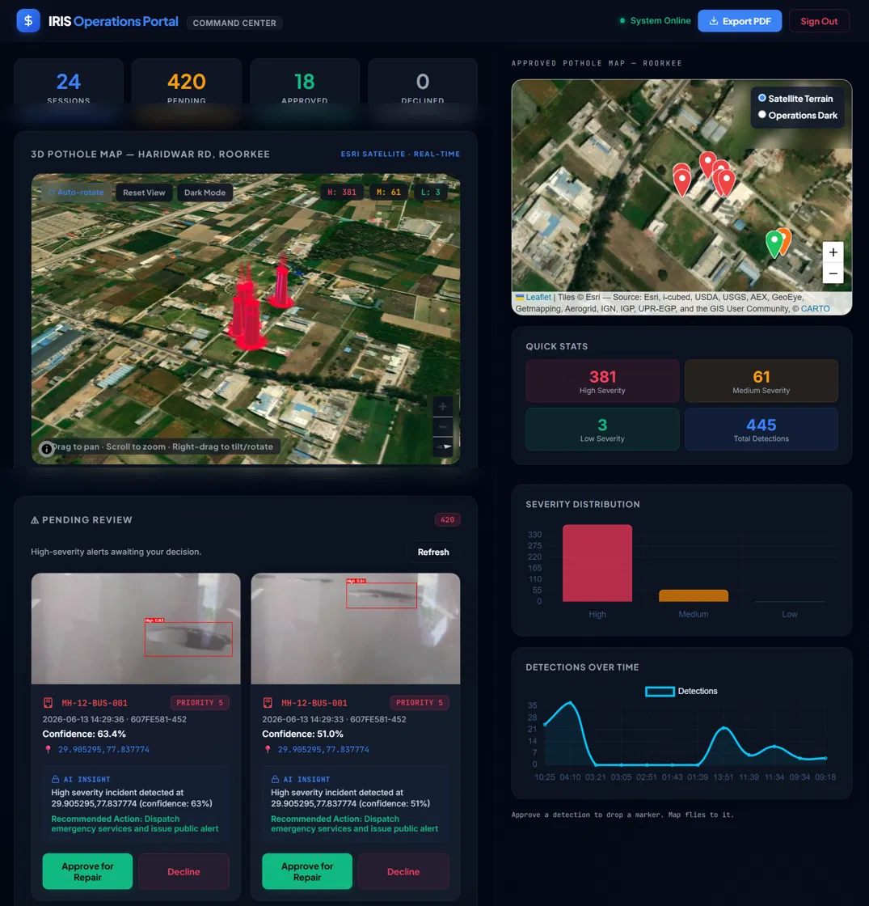
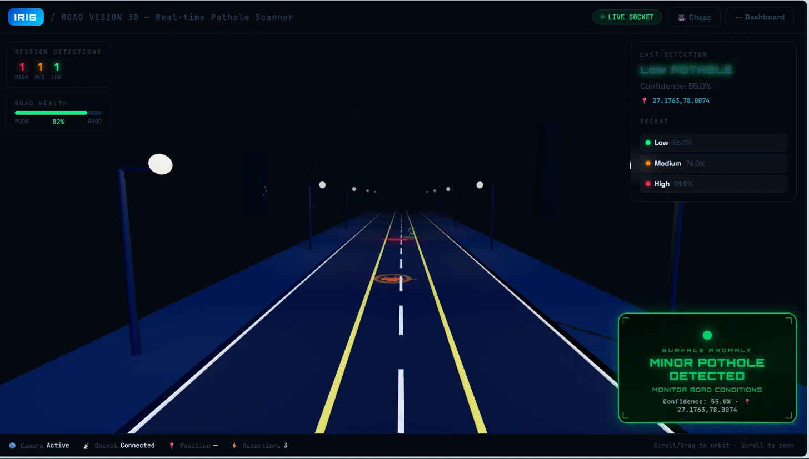
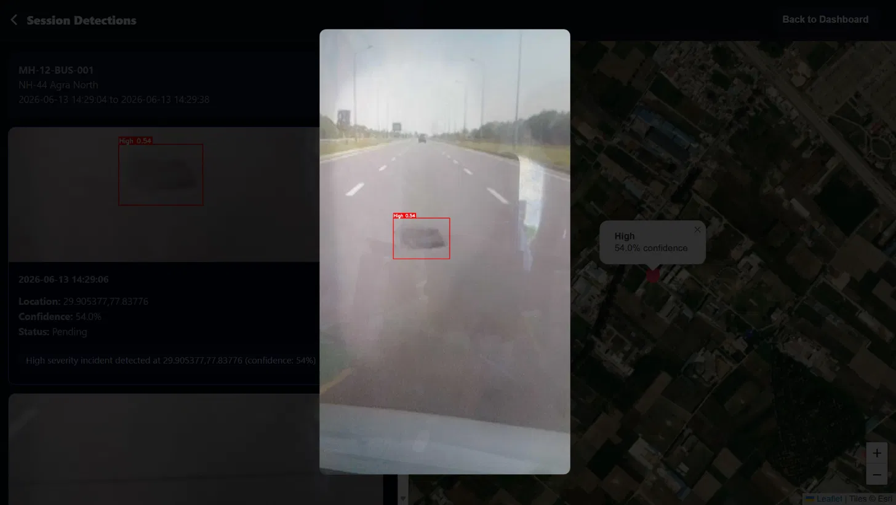
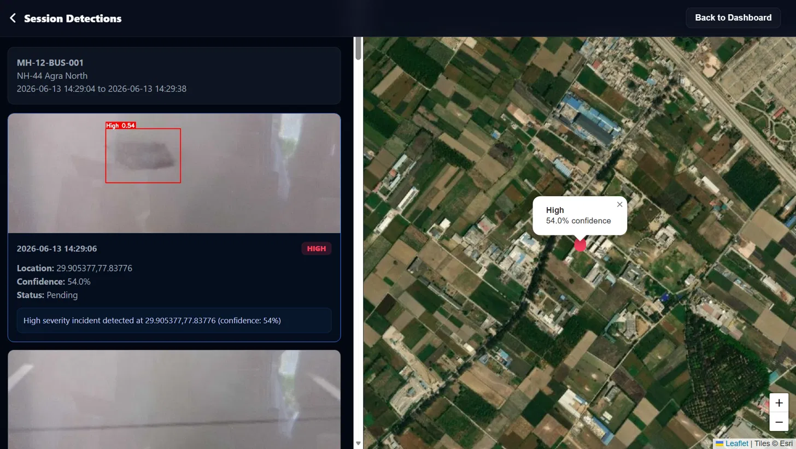
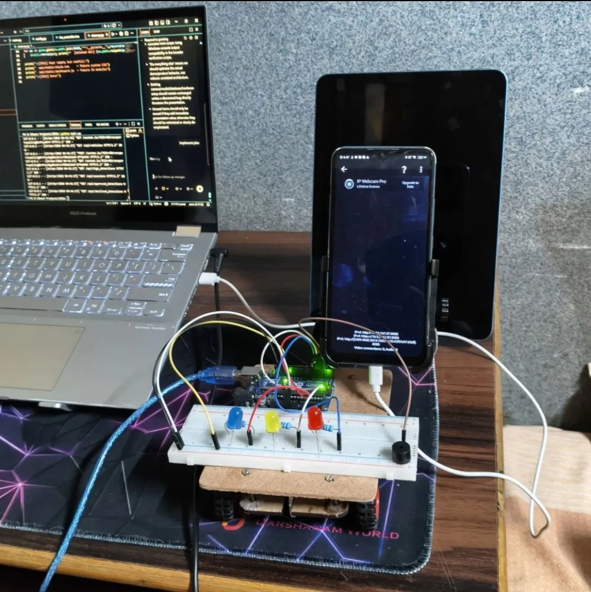

# 🚧 IRIS — Intelligent Road Inspection System

### AI-Powered Road Inspection & Pothole Detection System

Making road inspection smarter, faster, and data-driven using Artificial Intelligence and Computer Vision.

---

## 📌 About

**IRIS (Intelligent Road Inspection System)** is an AI-powered road inspection platform designed to **detect potholes and road damage automatically**. It uses **YOLOv8, Computer Vision, OpenCV, GPS, Python, and Flask** to analyze road images, identify damaged areas, and provide accurate, data-driven insights for **smarter and more efficient road monitoring and maintenance**.

---

## 🎯 Problem Statement

Road damage such as potholes can cause:

* 🚗 Vehicle damage
* ⚠️ Road safety risks
* 🚦 Traffic problems
* 💰 Higher maintenance costs
* 🏙️ Difficult infrastructure management

Traditional road inspection can be time-consuming and heavily dependent on manual work.

**IRIS aims to make road inspection faster, more automated, and data-driven.**

---

## 💡 Our Solution

IRIS combines **Computer Vision, AI-based object detection, GPS, and a web interface** to support intelligent road inspection.

```text
Road / Camera Input
        ↓
Image / Video Processing
        ↓
Computer Vision
        ↓
YOLOv8 Detection
        ↓
Pothole / Road Damage Detection
        ↓
Location & Inspection Data
        ↓
Web Interface
        ↓
Road Inspection Analysis
```

---

# 📸 Project Demo

## 🌐 IRIS Web Portal

The main web portal provides an interface for interacting with the road inspection system.



---

## 🛣️ Road Vision

The Road Vision interface demonstrates the visual road-inspection workflow.



---

## 🔎 Detection Details

Detection details provide information about identified road defects and inspection results.



---

## 🖥️ Inspection Session

The inspection-session interface demonstrates how an inspection can be monitored and organized.



---

## ⚙️ Hardware Setup

The hardware setup demonstrates the physical components used for the road-inspection concept.



---

# ✨ Key Features

### 🕳️ AI Pothole Detection

Detects potholes and road defects using AI-based object detection.

### 🎥 Road Inspection

Supports visual inspection using camera and image-based input.

### 🧠 YOLOv8

Uses YOLOv8 for object detection and road-defect identification.

### 📷 Computer Vision

Uses OpenCV for image and visual processing.

### 📍 GPS Integration

Associates inspection information with location data.

### 🌐 Web Interface

Provides a web-based interface for interacting with inspection information.

### 📊 Inspection Reports

Provides organized inspection information for easier analysis.

### 🏙️ Smart-City Application

Designed with intelligent infrastructure and smart-city road monitoring in mind.

---

# 🛠️ Technology Stack

| Technology | Purpose              |
| ---------- | -------------------- |
| 🐍 Python  | Core development     |
| 🤖 YOLOv8  | Object detection     |
| 👁️ OpenCV | Computer vision      |
| 🌐 Flask   | Web application      |
| 📍 GPS     | Location information |
| HTML       | Web structure        |
| CSS        | Web styling          |
| JavaScript | Web interaction      |

---

# 🏗️ System Architecture

```text
                 ┌─────────────────────┐
                 │   Camera / Input    │
                 └──────────┬──────────┘
                            ↓
                 ┌─────────────────────┐
                 │  Image Processing   │
                 │       OpenCV        │
                 └──────────┬──────────┘
                            ↓
                 ┌─────────────────────┐
                 │     YOLOv8 Model    │
                 │   Object Detection  │
                 └──────────┬──────────┘
                            ↓
                 ┌─────────────────────┐
                 │ Pothole / Road      │
                 │ Damage Detection    │
                 └──────────┬──────────┘
                            ↓
                 ┌─────────────────────┐
                 │ GPS / Inspection    │
                 │ Information         │
                 └──────────┬──────────┘
                            ↓
                 ┌─────────────────────┐
                 │    Flask Web        │
                 │     Interface       │
                 └──────────┬──────────┘
                            ↓
                 ┌─────────────────────┐
                 │ Road Inspection     │
                 │ Dashboard           │
                 └─────────────────────┘
```

---

# 🔄 How It Works

### 1️⃣ Capture

Road images or video are collected through the inspection input.

### 2️⃣ Processing

The visual input is processed using computer-vision techniques.

### 3️⃣ Detection

YOLOv8 analyzes the input and identifies relevant road defects.

### 4️⃣ Location

GPS information can be associated with inspection data.

### 5️⃣ Visualization

Results are presented through the web interface.

### 6️⃣ Analysis

Inspection information can help identify road conditions and areas requiring attention.

---

# 📂 Project Structure

```text
IRIS/
│
├── screenshots/
│   ├── detection-detail.png
│   ├── hardware.png
│   ├── portal.png
│   ├── roadvision.png
│   └── session.png
│
├── web/
│   ├── static/
│   │   ├── images/
│   │   └── css
│   ├── templates/
│   │   └── index.html
│   ├── __init__.py
│   ├── app.py
│   └── report.py
│
├── docs/
├── .github/
├── .gitignore
├── LICENSE
├── requirements.txt
└── README.md
```

---

# 🖥️ Web Interface

The IRIS web interface is designed to provide a simple way to interact with road-inspection information.

It focuses on:

* 🛣️ Road inspection
* 🔎 Detection visualization
* 🖥️ Inspection sessions
* 📊 Detection information
* 🚧 Road-condition monitoring

---

# 📊 Detection & Inspection

The system is designed around an AI-assisted detection workflow.

Inspection information can help users understand:

* What was detected
* Where the inspection occurred
* What the road condition looks like
* Which areas may require attention

---

# 🌍 Real-World Applications

### 🏙️ Smart Cities

Automated monitoring of urban road infrastructure.

### 🛣️ Highway Inspection

Supporting inspection teams in identifying road defects.

### 🚧 Municipal Road Maintenance

Helping identify roads that may require repair.

### 🚗 Road Safety

Supporting early identification of potholes and road problems.

### 📍 Road Condition Mapping

Using location information to support road-condition mapping.

### 🏗️ Infrastructure Management

Supporting large-scale infrastructure monitoring.

---

# 🚀 Installation

Clone the repository:

```bash
git clone https://github.com/saumayraj621-sudo/IRIS.git
cd IRIS
```

Install the required dependencies:

```bash
pip install -r requirements.txt
```

Run the Flask application:

```bash
python web/app.py
```

Then open the local Flask address in your browser.

> The exact runtime behavior may depend on the current application configuration.

---

# 🔧 Development

The repository separates the web application, demonstration screenshots, and documentation.

```text
screenshots/    → Project demonstration images
web/            → Web application
docs/           → Project documentation
requirements.txt → Python dependencies
README.md       → Project documentation
```

---

# 🔮 Future Scope

### 🤖 Improved AI Models

Improve detection accuracy and support additional road-defect categories.

### 📱 Mobile Application

Develop a mobile application for field-based road inspection.

### ☁️ Cloud Integration

Store inspection results and road-condition information in the cloud.

### 🗺️ Interactive Road Map

Display detected potholes and road defects on an interactive map.

### 📈 Advanced Analytics

Generate road-condition statistics and maintenance reports.

### 🚨 Severity Detection

Classify road damage according to severity and potential risk.

### 🏛️ Municipal Integration

Provide infrastructure teams with tools for managing road repairs.

### 🔔 Automated Alerts

Notify relevant authorities when significant road defects are detected.

---

# 🎓 Project Objective

The primary objective of IRIS is to demonstrate how **Artificial Intelligence, Computer Vision, GPS, and Web Technologies** can be combined to create an intelligent road-inspection solution.

The project focuses on making road inspection more **automated, visual, and data-driven**.

---

# 📈 Vision

> **Detect. Analyze. Locate. Improve.**

IRIS aims to contribute toward smarter infrastructure by using AI and computer vision to understand road conditions and support better road maintenance.

---

# 👨‍💻 Project Information

**Project:** IRIS — Intelligent Road Inspection System

**Domain:** Artificial Intelligence / Machine Learning / Computer Vision

**Application:** Road Inspection & Pothole Detection

**Repository:** IRIS

---

# ⭐ Support

If you find this project interesting, consider giving the repository a ⭐ on GitHub.

---

### 🚧 IRIS — Building Smarter Roads with AI

**Artificial Intelligence • Computer Vision • Smart Infrastructure**
